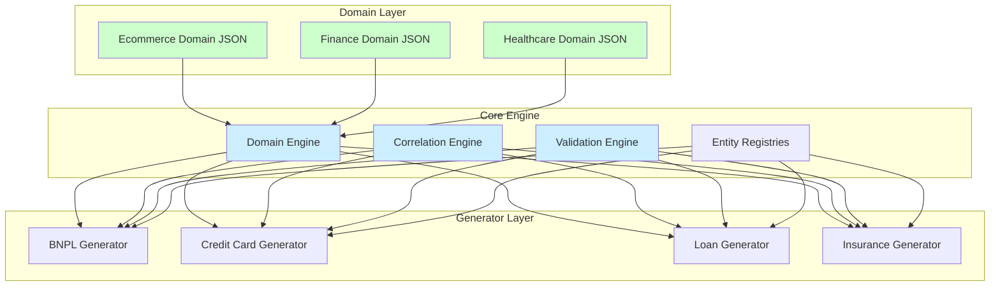

# Simtom Roadmap

This document tracks planned architectural improvements for scaling Simtom to support 1000+ generators across multiple industries while maintaining data quality and performance.

## Architecture Evolution

### Current State

```mermaid
graph TD
    A[BNPL Generator] --> B[Hard-coded Demographics]
    A --> C[Hard-coded Price Ranges]
    A --> D[Hard-coded Risk Logic]
    A --> E[Entity Registries]

    F[Credit Card Generator] --> G[Hard-coded Demographics]
    F --> H[Hard-coded Price Ranges]
    F --> I[Hard-coded Risk Logic]
    F --> J[Entity Registries]

    K[Future Generator N] --> L[Hard-coded Demographics]
    K --> M[Hard-coded Price Ranges]
    K --> N[Hard-coded Risk Logic]
    K --> O[Entity Registries]

    style B fill:#ffcccc
    style C fill:#ffcccc
    style D fill:#ffcccc
    style G fill:#ffcccc
    style H fill:#ffcccc
    style I fill:#ffcccc
    style L fill:#ffcccc
    style M fill:#ffcccc
    style N fill:#ffcccc
```


### Target State


## Current Architecture Limitations

- Business logic embedded in generator code (difficult for domain experts to contribute)
- Pattern duplication across similar generators (maintenance overhead)
- Tight coupling between domain knowledge and technical implementation
- Limited reusability of industry-specific patterns

## Target Architecture: Domain-Aware Generation

### Design Principles
- **Separation of Concerns**: Domain knowledge, business logic, and technical implementation as distinct layers
- **Memory Efficiency**: Shared domain patterns, lazy loading, no additional entity storage
- **Contribution Accessibility**: Industry experts contribute via configuration, not code
- **Backward Compatibility**: Existing generators continue to work during migration

### Architecture Overview
```
Domain Patterns (JSON)  →  Generator Logic (Python)  →  Core Engine (Framework)
       ↑                         ↑                          ↑
  Industry Expert           Use Case Expert           Technical Expert
```

## Roadmap Items

### R1: Domain-Aware Generator Framework
**Status**: Not Started | **Dependencies**: None

**Problem**: Current generators require deep technical knowledge and duplicate business patterns.

**Solution**: Create abstraction layer separating domain knowledge from implementation.

**Key Components**:
- `DomainEngine` class for pattern application
- `DomainAwareGenerator` base class with domain integration
- JSON schema for domain configuration
- Migration utilities for existing generators

**Architecture Changes**:
```python
# Before: Hard-coded in generator
class BNPLGenerator:
    def __init__(self):
        self.income_brackets = ["<25k", "25k-50k", ...]  # Duplicated across generators

# After: Shared domain knowledge
@register_generator("bnpl", domain="ecommerce")
class BNPLGenerator(DomainAwareGenerator):
    # Domain patterns loaded automatically
    # Focus only on BNPL-specific business logic
```

**Memory Impact**: Neutral (shared JSON configs replace duplicated Python constants)

---

### R2: Configurable Correlation Engine
**Status**: Not Started | **Dependencies**: R1

**Problem**: Current correlations are either absent or hard-coded with questionable assumptions.

**Solution**: Flexible correlation system with configurable strength and validation.

**Features**:
- Correlation strength parameters (0.0 = independent, 1.0 = deterministic)
- Multi-factor correlation support
- Business logic validation (prevent impossible combinations)
- Performance optimization for large datasets

**Example Configuration**:
```json
{
  "correlations": {
    "age_category_preference": {
      "strength": 0.2,
      "factors": ["age_bracket"],
      "effects": {
        "18-24": {"electronics": 1.3, "beauty": 1.2},
        "35-44": {"home": 1.4, "electronics": 0.8}
      }
    }
  }
}
```

**Memory Impact**: Minimal (correlation matrices cached, cleared periodically)

---

### R3: Multi-Industry Domain Library
**Status**: Not Started | **Dependencies**: R1

**Problem**: Each new industry requires rebuilding common patterns from scratch.

**Solution**: Pre-built, validated domain patterns for major industries.

**Target Domains**:
- **E-commerce**: Customer demographics, product categories, seasonal patterns
- **Finance**: Credit products, risk distributions, regulatory constraints
- **Healthcare**: Patient demographics, treatment patterns, privacy requirements
- **Marketing**: Campaign patterns, customer segments, channel behaviors
- **IoT**: Device patterns, sensor data distributions, failure modes

**Contribution Model**:
```
Industry Expert → Domain JSON → Community Review → Validation → Release
```

**Quality Assurance**:
- Automated validation against known industry benchmarks
- Statistical distribution testing
- Business logic consistency checks

---

### R4: Smart Scenario System
**Status**: Not Started | **Dependencies**: R1

**Problem**: Business scenarios (economic stress, seasonal patterns) implemented inconsistently.

**Solution**: Reusable, composable scenario framework with inheritance.

**Features**:
- Scenario inheritance (base → industry → use-case specific)
- Context-aware probability adjustment
- Temporal pattern support (seasonal, economic cycles)
- Cross-generator scenario consistency

**Example**:
```json
{
  "scenarios": {
    "economic_stress": {
      "base_probability": 0.08,
      "context_modifiers": {
        "recession_period": 2.5,
        "holiday_season": 0.3
      },
      "affected_behaviors": ["higher_default_rates", "lower_spending"]
    }
  }
}
```

---

### R5: Real-Time Data Quality Monitoring
**Status**: Not Started | **Dependencies**: R1, R2

**Problem**: Data quality regressions discovered only when users complain.

**Solution**: Continuous validation with automated alerts.

**Monitoring**:
- Distribution drift detection
- Correlation coefficient tracking
- Business logic violation alerts
- Performance regression detection

**Implementation**:
- Lightweight sampling during generation
- Configurable quality thresholds
- Integration with existing monitoring infrastructure

---

### R6: Performance Optimization for Scale
**Status**: Not Started | **Dependencies**: R1

**Problem**: Current architecture may not handle 1000+ concurrent generators efficiently.

**Solution**: Optimize for massive scale while maintaining quality.

**Optimizations**:
- Shared entity pools across related generators
- Lazy domain pattern loading
- Memory-efficient correlation caching
- Parallel generation with controlled resource usage

**Target Performance**:
- 1000+ active generators
- <100MB additional memory overhead
- <10ms latency increase per generator
- Maintained throughput rates

---

## Implementation Strategy

### Phase 1: Foundation
- Complete R1 (Domain-Aware Framework)
- Migrate existing BNPL generator as proof of concept
- Create ecommerce domain patterns
- Validate memory efficiency claims

### Phase 2: Enhancement
- Complete R2 (Correlation Engine)
- Complete R4 (Smart Scenarios)
- Add finance domain patterns
- Performance validation at moderate scale

### Phase 3: Scale
- Complete R3 (Multi-Industry Library)
- Complete R6 (Performance Optimization)
- Community contribution tools
- Large-scale validation (100+ generators)

### Phase 4: Operations
- Complete R5 (Quality Monitoring)
- Documentation and contribution guidelines
- Community onboarding
- Operational runbooks

## Technical Considerations

### Backward Compatibility
- Existing generators continue working unchanged
- Migration utilities provided for gradual adoption
- API compatibility maintained during transition

### Memory Efficiency
- Domain JSON configs shared across generators (singleton pattern)
- No additional entity storage required
- Correlation caches with configurable size limits
- Memory usage scales sub-linearly with generator count

### Performance
- JSON parsing cost amortized across generator instances
- Correlation calculations optimized with caching
- No impact on core generation throughput
- Lazy loading prevents unnecessary resource consumption

## Success Metrics

- **Scale**: 1000+ active generators across 10+ industries
- **Quality**: <1% business logic violations, realistic distribution maintenance
- **Performance**: Memory overhead <10% vs current, latency increase <5%
- **Community**: Self-service domain contribution by industry experts
- **Maintainability**: 90% reduction in duplicated business logic code

## Known Issues & Limitations

### K1: Historical vs Current-Date Data Inconsistency
**Issue**: Target variables (`will_default`, `days_to_first_missed_payment`) represent historical outcomes but are generated for current-date transactions, creating logical inconsistency.

**Impact**: ML teams must understand these fields represent "what we now know happened" for historical data vs "what we predict will happen" for current data.

**Workaround**: Document fields with warnings. ML teams should ignore target variables when using current-date generation mode.

**Future Solution**: Implement mode-specific field generation or separate historical/predictive field sets.

### K2: Pydantic V1 Deprecation Warnings
**Issue**: Current codebase uses Pydantic V1 `@validator` decorators which are deprecated in Pydantic V2.

**Impact**: Warning noise in test output, future compatibility concerns.

**Workaround**: Warnings don't affect functionality.

**Future Solution**: Migrate to Pydantic V2 `@field_validator` syntax.

---

*This roadmap represents the technical foundation for scaling Simtom while maintaining data quality and performance. Each item builds incrementally toward the goal of supporting massive generator ecosystems with minimal operational overhead.*