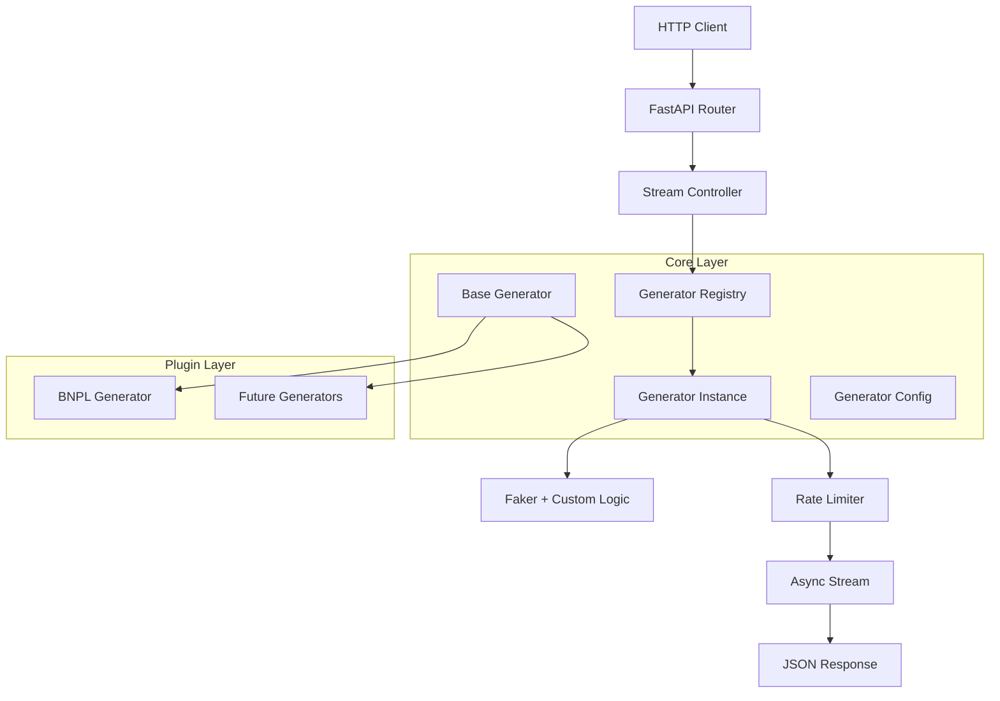

# simtom Architecture

This document provides a comprehensive overview of simtom's architecture, design principles, and implementation details for contributors and advanced users.

## 🏗️ Core Architecture

### Design Philosophy

simtom is built on four fundamental principles:

1. **Plugin Architecture**: Extensible without core modifications
2. **Async-First**: Non-blocking I/O for streaming data generation
3. **Type Safety**: Comprehensive type hints and Pydantic validation
4. **Separation of Concerns**: Clear boundaries between layers

### System Overview



## 📦 Module Structure

### Core Components (`simtom/core/`)

#### `generator.py` - Foundation Layer

**Purpose**: Defines the contract for all data generators

```python
# Core abstractions
class BaseGenerator(ABC):
    """Abstract base class for all data generators."""

    @abstractmethod
    async def generate_record(self) -> Dict[str, Any]:
        """Generate a single synthetic record."""
        pass

    async def stream(self) -> AsyncGenerator[Dict[str, Any], None]:
        """Stream records at configured rate."""
        # Rate limiting and streaming logic
```

**Key Features**:
- **Rate Limiting**: Built-in delay between records
- **Reproducibility**: Seeded random number generation
- **Streaming**: Memory-efficient async generators
- **Lifecycle Management**: Setup and cleanup hooks

#### `registry.py` - Plugin Discovery

**Purpose**: Automatic discovery and registration of generators

```python
class PluginRegistry:
    """Singleton registry for auto-discovering generators."""

    def __init__(self):
        self._generators: Dict[str, Type[BaseGenerator]] = {}

    def register(self, name: str, generator_class: Type[BaseGenerator]):
        """Register a generator class."""

    def get_generator(self, name: str) -> Type[BaseGenerator]:
        """Get generator class by name."""

    def list_generators(self) -> List[str]:
        """List all registered generator names."""
```

**Plugin Registration**:
```python
@register_generator("my_generator")
class MyGenerator(BaseGenerator):
    # Implementation
```

**Discovery Process**:
1. Import scanning during startup
2. Decorator registration
3. Validation of generator contracts
4. Name collision detection

#### `entities.py` - Data Models

**Purpose**: Core data structures and configurations

```python
class GeneratorConfig(BaseModel):
    """Configuration for data generation."""
    # Core generation parameters
    rate_per_second: float = Field(1.0, ge=0.1, le=1000.0)
    total_records: Optional[int] = Field(None, ge=0)
    seed: Optional[int] = Field(None)
    time_compression: float = Field(1.0, ge=0.1, le=1000.0)

    # Historical date range parameters (NEW)
    start_date: Optional[date] = Field(None, description="Start date for historical data")
    end_date: Optional[date] = Field(None, description="End date for historical data")
    include_holiday_patterns: bool = Field(True, description="Include holiday traffic patterns")
    weekend_multiplier: float = Field(0.85, description="Weekend vs weekday traffic ratio")
```

**Key Features:**
- **Historical Data Generation**: Generate data for specific date ranges with realistic temporal patterns
- **Holiday Effects**: Configurable traffic multipliers for major shopping holidays (industry-specific)
- **Business Hour Patterns**: 70% during 9am-6pm, 20% evenings, 10% nights
- **Weekend Adjustments**: Configurable reduction in weekend activity

#### `holidays.py` - Holiday System (NEW)

**Purpose**: Industry-agnostic holiday calculation with context-specific effects

```python
def get_major_holidays(year: int) -> Dict[str, date]:
    """Calculate major holidays for a given year."""
    return {
        'black_friday': calculate_black_friday(year),
        'christmas_day': date(year, 12, 25),
        'valentines_day': date(year, 2, 14),
        # ... more holidays
    }

def get_active_holidays(target_date: date) -> List[str]:
    """Get all holidays/periods active on a specific date."""
```

**Key Design Principles:**
- **Industry Agnostic**: Holiday calculation separate from business impact
- **Generator-Specific Effects**: Each generator defines its own holiday multipliers
- **Extensible**: Easy to add new holidays or periods
- **Performance**: Holiday calculations cached per year

**Example Usage:**
```python
class BNPLConfig(BaseEcommerceConfig):
    holiday_multipliers: Dict[str, float] = {
        'black_friday': 1.6,        # +60% for e-commerce
        'christmas_shopping': 1.3,  # +30% for Christmas season
    }

# Different industries have different effects
class B2BConfig(GeneratorConfig):
    holiday_multipliers: Dict[str, float] = {
        'black_friday': 0.7,        # -30% for B2B (offices closed)
        'christmas_week': 0.3,      # -70% for year-end shutdowns
    }
```

### API Layer (`simtom/api/`)

#### `main.py` - Application Factory

**Purpose**: FastAPI application setup and lifecycle management

```python
def create_app() -> FastAPI:
    """Create and configure FastAPI application."""
    app = FastAPI(
        title="simtom",
        description="Synthetic data generation platform",
        version="0.1.0"
    )

    # Plugin discovery
    discover_generators()

    # Route registration
    app.include_router(data_router)

    return app
```

**Startup Process**:
1. Plugin discovery and registration
2. Generator validation
3. Route configuration
4. Health check setup

#### `routes.py` - HTTP Endpoints

**Purpose**: REST API for data generation

```python
@router.post("/stream/{generator_name}")
async def stream_data(
    generator_name: str,
    config: GeneratorConfigRequest
) -> StreamingResponse:
    """Stream synthetic data from specified generator."""

    # Get generator class
    generator_class = registry.get_generator(generator_name)

    # Create instance
    generator = generator_class(config.to_generator_config())

    # Stream response
    return StreamingResponse(
        stream_json_records(generator),
        media_type="application/x-ndjson"
    )
```

**Streaming Implementation**:
```python
async def stream_json_records(generator: BaseGenerator):
    """Convert generator stream to JSON lines."""
    async for record in generator.stream():
        yield json.dumps(record) + "\n"
```

#### `models.py` - Request/Response Schemas

**Purpose**: Pydantic models for API validation

```python
class GeneratorConfigRequest(BaseModel):
    """Request schema for generator configuration."""
    rate_per_second: float = Field(1.0, description="Records per second")
    total_records: Optional[int] = Field(None, description="Total records to generate")
    seed: Optional[int] = Field(None, description="Random seed for reproducibility")

class GeneratorInfo(BaseModel):
    """Response schema for generator information."""
    name: str
    description: str
    config_schema: Dict[str, Any]
```

### Generator Layer (`simtom/generators/`)

#### Plugin Architecture

Each generator domain has its own module:

```
generators/
├── __init__.py
├── ecommerce/
│   ├── __init__.py
│   ├── base.py          # Common ecommerce patterns
│   └── bnpl.py          # BNPL-specific generator
├── finance/
│   ├── __init__.py
│   ├── base.py          # Common financial patterns
│   └── credit_cards.py  # Credit card transactions
└── healthcare/
    ├── __init__.py
    ├── base.py          # Common healthcare patterns
    └── patient_records.py
```

#### Base Classes Pattern

```python
# generators/ecommerce/base.py
class EcommerceBaseGenerator(BaseGenerator):
    """Base class for ecommerce generators."""

    def __init__(self, config: GeneratorConfig):
        super().__init__(config)
        self.merchants = self._load_merchant_data()
        self.products = self._load_product_data()

    def generate_customer_id(self) -> str:
        """Generate realistic customer ID."""
        return f"cust_{self.faker.uuid4()}"

    def generate_transaction_amount(self, category: str) -> float:
        """Generate amount based on category."""
        # Category-specific logic
```

#### Generator Implementation

```python
# generators/ecommerce/bnpl.py
@register_generator("bnpl")
class BNPLGenerator(EcommerceBaseGenerator):
    """Generate BNPL transaction data with risk scoring."""

    async def generate_record(self) -> Dict[str, Any]:
        customer_id = self.generate_customer_id()
        amount = self.generate_transaction_amount("bnpl")

        return {
            "transaction_id": str(uuid4()),
            "customer_id": customer_id,
            "amount": amount,
            "merchant": self.faker.company(),
            "product_category": self.faker.random_element(self.categories),
            "credit_score": self._generate_credit_score(),
            "default_risk": self._calculate_default_risk(),
            "timestamp": datetime.utcnow().isoformat()
        }

    def _generate_credit_score(self) -> int:
        """Generate realistic credit score."""
        # Statistical distribution logic

    def _calculate_default_risk(self) -> float:
        """Calculate risk based on multiple factors."""
        # Risk modeling logic
```

## 🔄 Data Flow

### Request Processing Flow

1. **HTTP Request** → FastAPI receives streaming request
2. **Validation** → Pydantic validates request schema
3. **Registry Lookup** → Find generator class by name
4. **Instance Creation** → Create generator with configuration
5. **Stream Initialization** → Setup async generator
6. **Rate-Limited Generation** → Generate records with timing
7. **JSON Serialization** → Convert records to JSON
8. **HTTP Streaming** → Stream response to client

### Memory Management

```python
# Efficient streaming without memory accumulation
async def stream_data():
    async for record in generator.stream():
        # Process immediately, don't accumulate
        yield json.dumps(record) + "\n"
        # Memory freed after each yield
```

### Error Handling

```python
# Generator-level error handling
class BaseGenerator:
    async def stream(self):
        try:
            while not self.should_stop():
                record = await self.generate_record()
                yield record
                await self.rate_limit()
        except Exception as e:
            logger.error(f"Generation error: {e}")
            raise GenerationError(f"Failed to generate data: {e}")

# API-level error handling
@router.post("/stream/{generator_name}")
async def stream_data(generator_name: str, config: GeneratorConfigRequest):
    try:
        generator_class = registry.get_generator(generator_name)
    except KeyError:
        raise HTTPException(404, f"Generator '{generator_name}' not found")

    try:
        generator = generator_class(config.to_generator_config())
        return StreamingResponse(stream_json_records(generator))
    except ValidationError as e:
        raise HTTPException(422, f"Invalid configuration: {e}")
```

## ⚡ Performance Architecture

### Async Streaming

**Why Async?**
- Non-blocking I/O for concurrent requests
- Memory-efficient streaming for large datasets
- Better resource utilization

**Implementation**:
```python
# Async generator pattern
async def stream(self) -> AsyncGenerator[Dict[str, Any], None]:
    record_count = 0
    start_time = time.time()

    while not self.should_stop(record_count):
        # Generate record
        record = await self.generate_record()
        yield record

        # Rate limiting
        await self.apply_rate_limit(record_count, start_time)
        record_count += 1
```

### Rate Limiting Algorithm

```python
async def apply_rate_limit(self, record_count: int, start_time: float):
    """Apply rate limiting to maintain specified rate."""
    expected_time = start_time + (record_count / self.config.rate_per_second)
    current_time = time.time()

    if current_time < expected_time:
        delay = expected_time - current_time
        await asyncio.sleep(delay)
```

### Memory Optimization

1. **Generator Pattern**: Stream processing without accumulation
2. **Lazy Loading**: Load reference data on-demand
3. **Object Pooling**: Reuse expensive objects
4. **Garbage Collection**: Explicit cleanup in generators

## 🔌 Plugin System

### Registration Mechanism

```python
# Registry singleton
_registry = PluginRegistry()

def register_generator(name: str):
    """Decorator for registering generators."""
    def decorator(cls: Type[BaseGenerator]):
        _registry.register(name, cls)
        return cls
    return decorator

# Usage
@register_generator("my_generator")
class MyGenerator(BaseGenerator):
    pass
```

### Discovery Process

```python
def discover_generators():
    """Discover and import all generator modules."""
    generators_path = Path(__file__).parent / "generators"

    for module_file in generators_path.rglob("*.py"):
        if module_file.name.startswith("_"):
            continue

        module_path = get_module_path(module_file)
        try:
            importlib.import_module(module_path)
        except ImportError as e:
            logger.warning(f"Failed to import {module_path}: {e}")
```

### Plugin Validation

```python
def register(self, name: str, generator_class: Type[BaseGenerator]):
    """Register generator with validation."""
    # Check inheritance
    if not issubclass(generator_class, BaseGenerator):
        raise ValueError(f"{generator_class} must inherit from BaseGenerator")

    # Check abstract methods
    if not hasattr(generator_class, 'generate_record'):
        raise ValueError(f"{generator_class} must implement generate_record")

    # Check name collision
    if name in self._generators:
        logger.warning(f"Generator '{name}' already registered, overwriting")

    self._generators[name] = generator_class
```

## 🛡️ Security & Safety

### Input Validation

```python
class GeneratorConfig(BaseModel):
    """Secure configuration with validation."""
    rate_per_second: float = Field(1.0, ge=0.1, le=1000.0)  # Prevent DoS
    total_records: Optional[int] = Field(None, ge=0, le=1_000_000)  # Memory protection
    seed: Optional[int] = Field(None, ge=0, le=2**32-1)  # Valid seed range
```

### Resource Limits

```python
# Built-in resource protection
class BaseGenerator:
    MAX_RECORDS_PER_REQUEST = 1_000_000
    MAX_RATE_PER_SECOND = 1000.0
    MAX_GENERATION_TIME = 3600  # 1 hour

    def validate_config(self, config: GeneratorConfig):
        if config.total_records and config.total_records > self.MAX_RECORDS_PER_REQUEST:
            raise ValueError(f"Cannot generate more than {self.MAX_RECORDS_PER_REQUEST} records")
```

### Data Safety

```python
# Prevent sensitive data leakage
class BaseGenerator:
    def sanitize_record(self, record: Dict[str, Any]) -> Dict[str, Any]:
        """Ensure no real sensitive data in synthetic records."""
        # Implementation-specific sanitization
        return record
```

## 🔧 Configuration System

### Hierarchical Configuration

```python
# Base configuration
class GeneratorConfig(BaseModel):
    """Base configuration for all generators."""
    rate_per_second: float = 1.0
    total_records: Optional[int] = None
    seed: Optional[int] = None

# Generator-specific configuration
class BNPLConfig(BaseModel):
    """BNPL-specific configuration."""
    default_rate: float = Field(0.05, description="Base default rate")
    credit_score_mean: float = Field(650, description="Mean credit score")
    seasonal_factor: bool = Field(True, description="Apply seasonal patterns")

# Combined configuration
@register_generator("bnpl")
class BNPLGenerator(BaseGenerator):
    def __init__(self, config: GeneratorConfig, bnpl_config: BNPLConfig = None):
        super().__init__(config)
        self.bnpl_config = bnpl_config or BNPLConfig()
```

### Environment Configuration

```python
# settings.py
class Settings(BaseSettings):
    """Application settings from environment."""
    app_name: str = "simtom"
    host: str = "0.0.0.0"
    port: int = 8000
    log_level: str = "info"
    redis_url: Optional[str] = None

    class Config:
        env_prefix = "SIMTOM_"

# Usage
settings = Settings()
```

## 🚀 Deployment Architecture

### Container Strategy

```dockerfile
# Multi-stage build for optimization
FROM python:3.11-slim as builder
WORKDIR /app
COPY pyproject.toml poetry.lock ./
RUN pip install poetry && poetry export -f requirements.txt --output requirements.txt

FROM python:3.11-slim as runtime
WORKDIR /app
COPY --from=builder /app/requirements.txt .
RUN pip install --no-cache-dir -r requirements.txt
COPY simtom/ ./simtom/
EXPOSE 8000
CMD ["uvicorn", "simtom.api:app", "--host", "0.0.0.0", "--port", "8000"]
```

### Health Checks

```python
@router.get("/health")
async def health_check():
    """Comprehensive health check."""
    return {
        "status": "healthy",
        "version": __version__,
        "generators_available": len(registry.list_generators()),
        "memory_usage": get_memory_usage(),
        "uptime": get_uptime()
    }
```

## 🔍 Monitoring & Observability

### Metrics Collection

```python
# metrics.py
class GenerationMetrics:
    """Track generation performance metrics."""

    def __init__(self):
        self.records_generated = 0
        self.generation_time = 0.0
        self.error_count = 0

    def record_generation(self, duration: float):
        self.records_generated += 1
        self.generation_time += duration

    def record_error(self):
        self.error_count += 1

    @property
    def avg_generation_time(self) -> float:
        return self.generation_time / max(self.records_generated, 1)
```

### Logging Strategy

```python
# logging_config.py
import structlog

logger = structlog.get_logger()

# Usage in generators
async def generate_record(self) -> Dict[str, Any]:
    start_time = time.time()
    try:
        record = await self._create_record()
        duration = time.time() - start_time

        logger.info(
            "record_generated",
            generator=self.__class__.__name__,
            duration=duration,
            record_size=len(str(record))
        )
        return record
    except Exception as e:
        logger.error(
            "generation_failed",
            generator=self.__class__.__name__,
            error=str(e),
            duration=time.time() - start_time
        )
        raise
```

## 🔮 Future Architecture

### Planned Enhancements

1. **Distributed Generation**
   ```python
   # Planned: Multi-node generation
   class DistributedGenerator:
       def __init__(self, nodes: List[str]):
           self.nodes = nodes
           self.coordinator = GenerationCoordinator()
   ```

2. **Schema Evolution**
   ```python
   # Planned: Schema versioning
   class VersionedSchema(BaseModel):
       schema_version: str = "1.0"

       def migrate_to_latest(self) -> "VersionedSchema":
           # Migration logic
   ```

3. **Advanced Scenarios**
   ```python
   # Planned: Complex scenario modeling
   class ScenarioEngine:
       def apply_drift(self, generator: BaseGenerator, drift_config: DriftConfig):
           # Gradual pattern changes

       def inject_anomalies(self, stream: AsyncGenerator, anomaly_rate: float):
           # Anomaly injection
   ```

This architecture enables simtom to scale from simple synthetic data generation to a comprehensive ML testing platform while maintaining simplicity and extensibility.